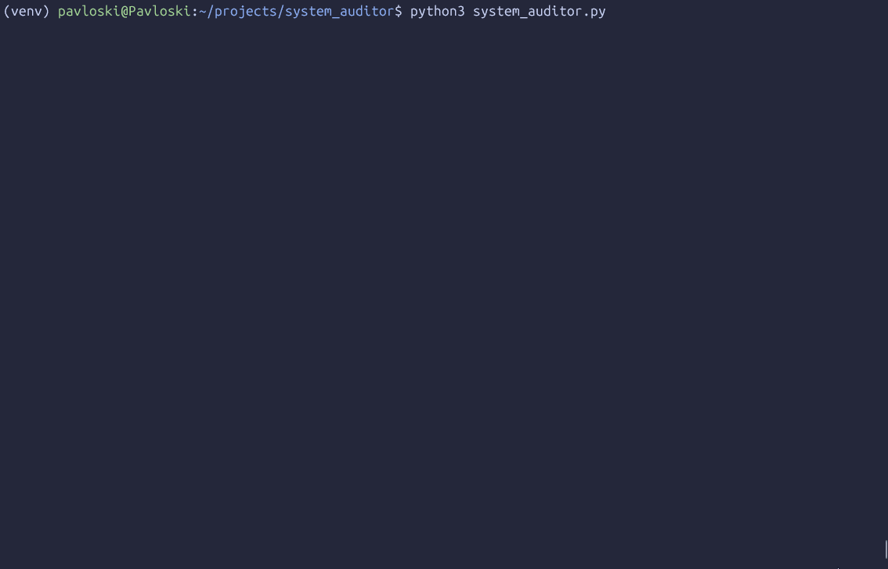

# Linux Recon Toolkit

> A lightweight, professional-grade reconnaissance script for Linux systems. This tool automates initial security and system health checks, gathering critical information on active users, login history, and listening network ports into a clean, time-stamped report.

This project was developed as a practical exercise in building robust, production-quality command-line tools with Python. The focus is not just on the final product, but on the professional software development practices used in its creation.

---



---

## 🚀 Features

-   **Active User Monitoring:** Identifies all users currently logged into the system.
-   **Login History:** Retrieves the last 10 login records for audit and review.
-   **Network Visibility:** Scans for and parses all listening TCP and UDP ports, identifying the processes using them.
-   **Cloud Detection:** Intelligently probes for the standard cloud metadata service to determine if the host is a cloud instance (AWS, GCP, Azure).
-   **Automated Reporting:** Aggregates all findings into a single, clean `.txt` report with a unique timestamp for easy record-keeping.

---

## ✨ Core Principles in Practice

This tool was built to demonstrate and practice key software engineering principles:

-   **Robustness & Error Handling:** The core command runner is wrapped in comprehensive `try...except` blocks, handling timeouts, missing commands, and execution errors gracefully.
-   **Security First:** Uses secure `subprocess` calls (with command arguments as a list) to prevent shell injection vulnerabilities.
-   **Modularity & Reusability:** Built with a modular design, where a single, hardened `run_command` function serves multiple, single-purpose audit functions.
-   **Clean Code & Readability:** Adheres to modern Python standards, including type hints (`-> str | None`) for improved clarity and maintainability.
-   **Professional Git Workflow:** Developed using feature branches for new functionality, ensuring the `main` branch always remains stable and verified.

---

## 🛠️ Getting Started

### Prerequisites

-   Python 3.8+
-   A Linux-based operating system
-   Standard Linux utilities (`who`, `last`, `ss`, `curl`)

### Installation & Execution

1.  **Clone the repository:**
    ```bash
    git clone https://github.com/QueenOverlord/linux-recon-toolkit.git
    cd linux-recon-toolkit
    ```

2.  **Set up a virtual environment (Recommended ):**
    ```bash
    python3 -m venv venv
    source venv/bin/activate
    ```

3.  **Run the script:**
    ```bash
    python3 auditor.py
    ```

Upon completion, the script will generate a `security_report_[timestamp].txt` file in the same directory with the full audit results.

---

## 📝 Project Structure Note

For simplicity in this single-script project, all source code resides in the root directory. In a larger, packageable application, a `src` layout would be used to formally separate source code from project configuration and tests, demonstrating a scalable and maintainable architecture. This decision was made consciously to keep the project focused and lean.
